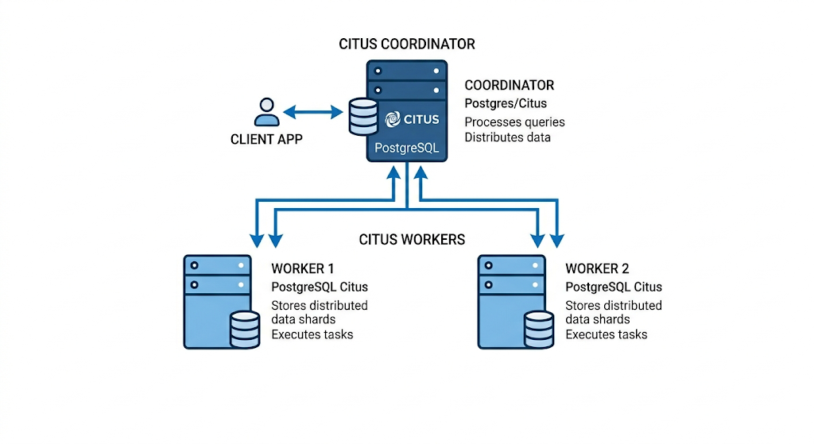

# Partie 2 — Distribution réelle avec Citus

## Introduction

Dans les parties précédentes, nous avons amélioré progressivement l'architecture de ShopFlow. Le partitionnement a réduit le périmètre de lecture en segmentant les tables localement. FDW a permis de déplacer physiquement des partitions sur des serveurs distants. Mais dans les deux cas, un point faible demeure : le serveur central supporte seul la charge de coordination et d'exécution des requêtes analytiques.

Citus répond à cette limite. Il transforme PostgreSQL en une base de données véritablement distribuée, où les requêtes sont découpées et exécutées en parallèle sur plusieurs machines — les workers. Plus on ajoute de workers, plus la capacité de traitement augmente. C'est de la scalabilité horizontale.

---

## A. Docker

Pour la partie Citus, nous allons utiliser Docker.

### Qu'est-ce qu'un conteneur Docker ?

Un conteneur est une mini-machine isolée qui tourne à l'intérieur de votre machine. Il a son propre système de fichiers, ses propres processus, son propre réseau. Il est léger, reproductible, et s'arrête proprement sans laisser de traces sur votre système.

Concrètement, au lieu d'installer Citus directement sur votre ordinateur, on va lancer des conteneurs qui contiennent déjà PostgreSQL + Citus préinstallés et préconfigurés.

### Docker Compose

Docker Compose permet de décrire et gérer plusieurs conteneurs en même temps à partir d'un seul fichier `docker-compose.yml`. Ce fichier permet de monter un cluster de 3 conteneurs en une seule commande.

### L'architecture des conteneurs

On simule un cluster Citus avec 3 conteneurs sur la même machine, chacun écoutant sur un port différent :

- `citus_coordinateur` — port 5432 : reçoit toutes les requêtes SQL, orchestre le travail
- `citus_worker1` — port 5433 : stocke et traite une partie des données
- `citus_worker2` — port 5434 : stocke et traite l'autre partie des données

Les trois conteneurs communiquent entre eux via un réseau interne Docker.

---

## B. Concepts Citus

### Principe de fonctionnement

Quand on déclare une table comme distribuée dans Citus, il la découpe en fragments appelés **shards**. Par défaut, Citus crée 32 shards par table et les répartit équitablement sur les workers disponibles.

La **clé de distribution** détermine dans quel shard va chaque ligne. C'est le choix le plus important de toute la configuration.

### Types de tables dans Citus

| Type | Description | Usage |
|------|-------------|-------|
| **Table distribuée** | Fragmentée sur les workers selon la clé | Grandes tables (`clients`, `commandes`) |
| **Table de référence** | Répliquée intégralement sur tous les workers | Petites tables peu modifiées (`produits`) |

### La colocalisation

Quand deux tables distribuées ont la même clé de distribution, Citus place leurs shards correspondants sur le même worker. Une jointure entre ces deux tables s'exécute alors **localement** sur chaque worker, sans transfert réseau.

!!! note
    Dans notre TP, `clients`, `commandes` et `details_commande` seront toutes trois distribuées sur `client_id`. Un client, ses commandes et les détails de ces commandes seront toujours sur le même worker.

---

## Étapes du TP

| Étape | Contenu |
|-------|---------|
| [Setup](setup.md) | Cluster Docker + création + distribution des tables |
| [Données](data.md) | Chargement des 5 millions de lignes |
| [Analyse](analyse.md) | Observer les shards et mesurer l'impact de la colocalisation |
